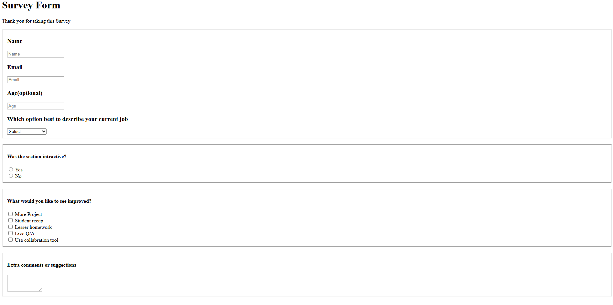

# Survey Form

## Description

This project is a simple **HTML-based survey form** created to collect user feedback and basic information. It demonstrates the use of standard HTML form elements in a clean and structured layout without external dependencies.

## Purpose

The purpose of this project is to practice and showcase:

* HTML form structure
* User input handling
* Semantic grouping of form elements
* Accessibility-friendly markup using labels and fieldsets

## Features

* Text inputs for name and email
* Optional numeric input for age
* Dropdown menu for job role selection
* Radio buttons for user experience feedback
* Checkboxes for multiple improvement options
* Text area for additional comments
* Submit button for form submission

## Technologies Used

* HTML5



## File Structure

```
project-root/
│
├── index.html
└── README.md
```

## Usage Instructions

1. Clone or download the repository.
2. Open the `index.html` file in any modern web browser.
3. Complete the survey form fields as required.
4. Click the **Submit** button to submit the form.

> Note: This project does not include backend processing. Form submissions are not stored or transmitted.

## Limitations

* No client-side or server-side validation implemented
* No form data handling or persistence
* Minimal accessibility enhancements

## Recommended Enhancements

* Add `required` attributes to essential inputs
* Change email input type to `email` for validation
* Include `name` attributes for all form elements
* Implement CSS for improved layout and visual design
* Add JavaScript for input validation and user feedback
* Integrate backend functionality for data storage

## Compatibility

* Compatible with all modern web browsers
* Tested on Chrome, Firefox, and Edge

## License

This project is provided for educational and demonstration purposes. No license restrictions apply.

---


